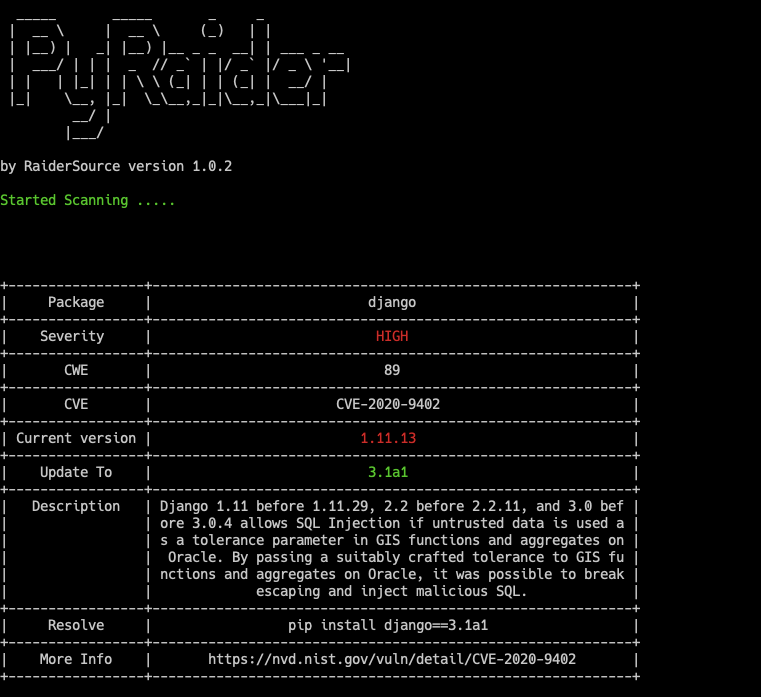

# PyRaider

> Using PyRaider You can scan installed dependencies known security vulnerabilities. It uses publicly known exploits, vulnerabilities database. [Documentation](https://pyraider.raidersource.com)

**Latest Version: 1.0.2**

**Note: Currently pyraider support above `python3` version.**



                                    
## Usage

# Table of Contents
1. [Installation](https://pyraider.raidersource.com/#/Installation)
2. [Scan Pakage](https://pyraider.raidersource.com/#/Scan?id=scan-python-packages)
2. [Scan Package by Severity](https://pyraider.raidersource.com/#/Scan?id=scan-packages-by-severity)
3. [Report](https://pyraider.raidersource.com/#/Report)
3. [CI/CD](https://pyraider.raidersource.com/#/CICD)
4. [Outdated package check](https://pyraider.raidersource.com/#/Validate)

[Documentation](https://pyraider.raidersource.com/#/)

### Install `pyraider` using `pip` or `pyenv`

```commandline
pip install pyraider
```

```commandline
pyenv install pyraider
```

### To check the list of options available.

```commandline
pyraider -h
```

##  Scan Vulnerabilities against the dependencies
> Using PyRaider you can scan the vulnerable packages.

### To run basic scan you can use `pyraider go` command. 
>It will automatically detects the installed packages and scans against it and shows the report.

```commandline
pyraider go
```

### If you want to scan you packages against `requirements.txt` or `Pipfile.lock` file.

```commandline
pyraider check -f /Users/raider/project/requirements.txt
```

```commandline
pyraider check -f /Users/raider/project/Pipfile.lock
```

## Reports
> PyRaider currently supports `JSON`, `HTML` and `CSV` formats.

### To Export as a `JSON` file.

```commandline
pyraider check -f /Users/raider/project/requirments.txt -e json result.json
```

```commandline
pyraider check -f /Users/raider/project/Pipfile.lock -e json result.json
```


### To Export as a `CSV` file.

```commandline
pyraider check -f /Users/raider/project/requirments.txt -e csv result.csv
```

```commandline
pyraider check -f /Users/raider/project/Pipfile.lock -e csv result.csv
```

### To Export as a `HTML` file.

```commandline
pyraider check -f /Users/raider/project/requirments.txt -e html result.html
```

```commandline
pyraider check -f /Users/raider/project/Pipfile.lock -e html result.html
```


## Out of Date Pacakges
> Using PyRaider you can check the latest packages. Against installed packages.

```commandline
pyraider validate -f /Users/raider/project/requirments.txt
```

```commandline
pyraider validate -f /Users/raider/project/Pipfile.lock
```

* It will check out of dated packages on the actiavted virtual environment.
```commandline
pyraider validate -p django==1.11.13
```


## Auto Fix
> PyRaider also supports `auto fix` feature. Using this you can fix the vulnerable packages.

**Note:** To updating the packages might affect your application.

### Fix
> You can fix packages vulnerabilities individually. Once it is installed it will automatically update the `requirments.txt` or `Pipfile.lock` file.

```
pyraider fix
```

### Autofix
> You can also fix packages vulnerabilities at one shot. Once it is installed it will automatically update the `requirments.txt` or `Pipfile.lock` file.

```
pyraider autofix
```

### Update latest database
> Now you can update the resource database with latest updated vulnerabilities

```
pyraider updatedb
```

## Docker container
> You can also run `pyraider` has a docker container.

### Build docker container image

```
docker build -t pyraider .
```

### Author
    
* [Tilak Thimmapppa](https://tilakt.com/)

### Contribute
* We welcome contributions to this project in the form of:
    * Feature Requests, Suggestions
    * Bugs
    * Help with writing tests
    * Add-on features, plugins, etc
    * Documentation

### Contact us:
* Email : tilaknayarmelpal@gmail.com
* Twitter : https://twitter.com/ti1akt